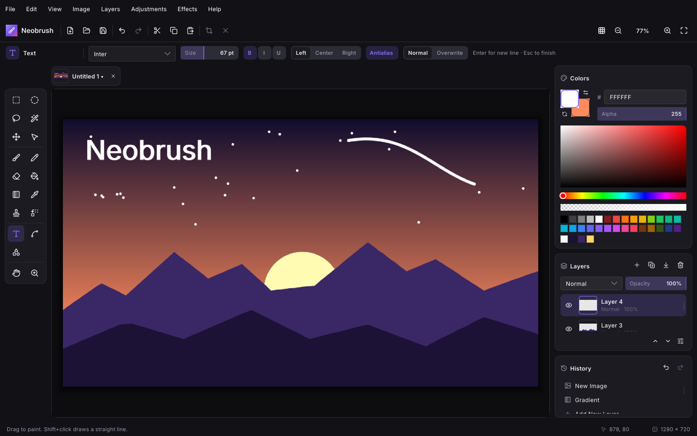
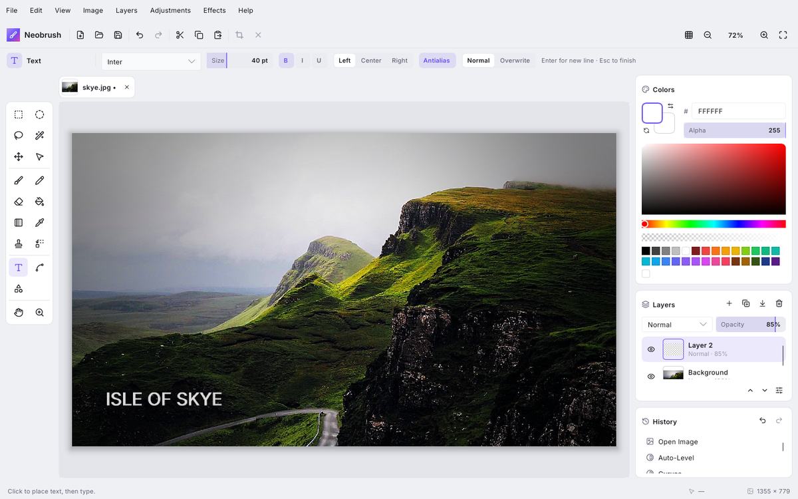
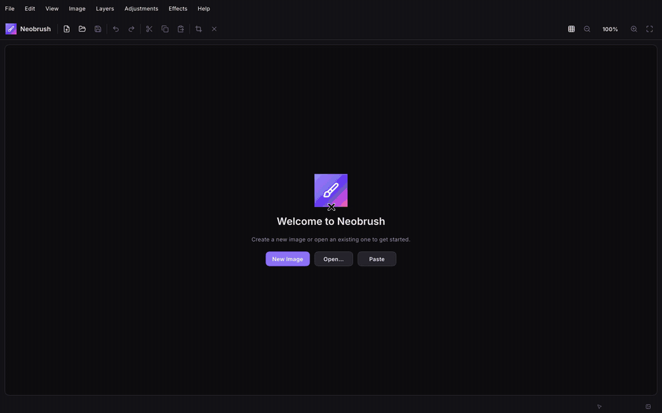
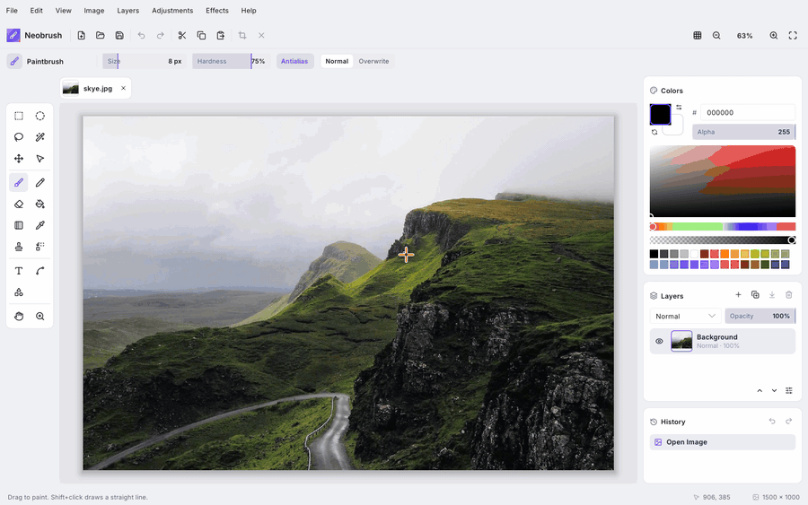
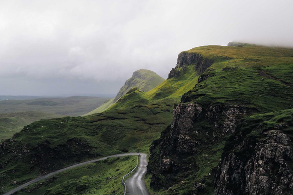
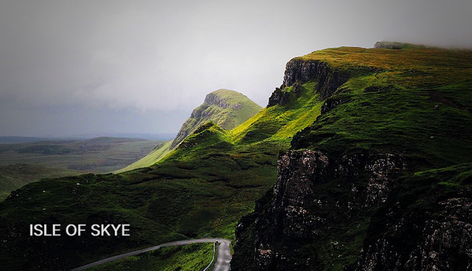

<div align="center">


# Neobrush

**A fast, modern raster graphics editor in the spirit of Paint.NET.**<br>
Native on Windows, macOS, Linux and FreeBSD. Light and dark, just like your OS.

[](https://github.com/WhiteBlackGoose/Neobrush/releases)
[](https://github.com/WhiteBlackGoose/Neobrush/actions/workflows/ci.yml)
[](LICENSE)


[**Download**](#download) · [Features](#features) · [Shortcuts](#shortcuts) · [Building](#building)

<br>

 

</div>

---

## ✨ See it in action

<table>
<tr>
<td width="50%" valign="top">

### 🎨 Painting from scratch

A gradient sky, a sun with a glow, lasso-cut mountains, stars on their own layer, a bezier shooting star and a title. Everything is done with Neobrush's own tools.

</td>
<td width="50%" valign="top">

### 📷 Editing a photo

Auto-Level, an S-curve in Curves, Hue/Saturation, Vignette, Sharpen, a crop and a caption layer. Then a jump through the History panel to compare before and after.

</td>
</tr>
<tr>
<td></td>
<td></td>
</tr>
</table>

<div align="center">

| Before | After |
| :---: | :---: |
|  |  |

<sub>Photo by <a href="https://unsplash.com/photos/Kt5hRENuotI">Andrew Ridley</a> on Unsplash. Both recordings are sped up to fit 30 seconds.</sub>

</div>

---

<a id="download"></a>

## 📦 Download

Grab the latest build from the [**Releases page**](https://github.com/WhiteBlackGoose/Neobrush/releases).

| Platform | Package | Notes |
| --- | --- | --- |
| 🐧 **Linux** (Debian, Ubuntu, Mint…) | `neobrush_*_amd64.deb` | `sudo apt install ./neobrush_*.deb` |
| 🐧 **Linux** (any distro) | `Neobrush-*-x86_64.AppImage` | `chmod +x` it, then run |
| ❄️ **NixOS / Nix** | flake | `nix run github:WhiteBlackGoose/Neobrush` |
| 🪟 **Windows** 10/11 | `Neobrush-*-windows-x86_64.exe` | portable, no installer needed |
| 🍎 **macOS** 11+ (Apple Silicon & Intel) | `Neobrush-*-macos-universal.dmg` | drag to Applications |
| 😈 **FreeBSD** | `neobrush-*-freebsd-x86_64.tar.gz` | |

> [!NOTE]
> Neobrush is in **alpha**. The Windows and macOS builds aren't code-signed yet.
> On macOS, right-click the app and choose **Open** the first time, or run
> `xattr -dr com.apple.quarantine /Applications/Neobrush.app`.
> On Windows, SmartScreen may ask you to confirm: choose **More info → Run anyway**.

**Staying up to date on Nix:** `nix profile install github:WhiteBlackGoose/Neobrush` installs it, and `nix profile upgrade Neobrush` updates it.

---

<a id="features"></a>

## 🧰 Features

<table>
<tr>
<td width="50%" valign="top">

#### 🖌️ Tools
- **Selection:** rectangle, ellipse, lasso, magic wand
- **Move selected pixels:** drag, scale with handles, rotate with right-drag
- **Paint:** paintbrush (size, hardness, antialiasing), pencil, eraser
- **Fill:** paint bucket and gradients (linear, reflected, diamond, radial, conical; color or transparency mode)
- **Retouch:** clone stamp, recolor, color picker
- **Text** in any system font, with bold, italic, underline and alignment
- **Line / curve:** bezier, solid, dashed or dotted
- **11 shapes**, from rectangles to stars and hearts
- Shapes, lines and text **stay editable** until you finish them

</td>
<td width="50%" valign="top">

#### 🗂️ Layers & selections
- Unlimited layers with **16 blend modes**
- Opacity, visibility, duplicate, merge down, reorder
- Import from file, flip, rotate / zoom
- Replace, add, subtract, intersect and invert selection modes
- Marching ants. Every tool and effect respects the selection
- Crop to selection, auto crop, resize, canvas size with anchor

</td>
</tr>
<tr>
<td valign="top">

#### 🎛️ Adjustments
Auto-Level · Black & White · Brightness / Contrast · **Curves** (per channel) · Hue / Saturation · Invert · **Levels** · Posterize · Sepia · Vibrance · Temperature / Tint

#### 🌈 Effects with live preview
<details>
<summary>33 effects in 8 categories</summary>

| Category | Effects |
| --- | --- |
| Artistic | Ink Sketch, Oil Painting, Pencil Sketch |
| Blurs | Fragment, Gaussian, Motion, Radial, Surface, Unfocus, Zoom |
| Distort | Bulge, Dents, Frosted Glass, Pixelate, Polar Inversion, Tile Reflection, Twist |
| Noise | Add Noise, Median, Reduce Noise |
| Photo | Glow, Red Eye Removal, Sharpen, Soft Portrait, Vignette |
| Render | Clouds, Julia Fractal, Mandelbrot Fractal |
| Stylize | Edge Detect, Emboss, Outline, Relief |
| Object | Drop Shadow |

</details>

</td>
<td valign="top">

#### 💎 Everything else
- Tabs with live thumbnails for multiple documents
- **History panel:** click any step to jump to it
- Clipboard: copy, copy merged, paste, paste into a new layer or image
- Zoom from 1% to 6400%, pixel grid, rulers
- HSV color picker with hex, alpha, palette and recent colors
- Light / dark theme follows the OS, or pick one in *View → Theme*
- Remembers your settings and recent files
- GPU-accelerated UI, multithreaded image processing

#### 💾 File formats
**OpenRaster** (`.ora`, layered, also opens in GIMP, Krita and MyPaint) ·
PNG · JPEG · WebP · BMP · GIF · TIFF · TGA · ICO · QOI

</td>
</tr>
</table>

---

<a id="shortcuts"></a>

## ⌨️ Keyboard shortcuts

Press <kbd>F1</kbd> in the app for the full list.

| Keys | Action |
| --- | --- |
| <kbd>S</kbd> <kbd>M</kbd> <kbd>B</kbd> <kbd>P</kbd> <kbd>E</kbd> <kbd>F</kbd> <kbd>G</kbd> <kbd>K</kbd> <kbd>L</kbd> <kbd>R</kbd> <kbd>T</kbd> <kbd>O</kbd> <kbd>H</kbd> <kbd>Z</kbd> | Switch tools (press <kbd>S</kbd>, <kbd>M</kbd> or <kbd>O</kbd> again to cycle) |
| <kbd>[</kbd> / <kbd>]</kbd> | Brush size |
| <kbd>X</kbd> / <kbd>D</kbd> | Swap / reset colors |
| <kbd>Space</kbd> + drag, middle mouse | Pan |
| <kbd>Ctrl</kbd> + wheel | Zoom |
| <kbd>Enter</kbd> / <kbd>Esc</kbd> | Finish text, shape or line |
| <kbd>Delete</kbd> / <kbd>Backspace</kbd> | Erase / fill selection |
| <kbd>Ctrl</kbd>+<kbd>Z</kbd> / <kbd>Ctrl</kbd>+<kbd>Y</kbd> | Undo / redo |
| <kbd>Ctrl</kbd>+<kbd>F</kbd> | Repeat last effect |

---

<a id="building"></a>

## 🔨 Building from source

You need a recent stable [Rust](https://rustup.rs) toolchain.

```sh
git clone https://github.com/WhiteBlackGoose/Neobrush
cd Neobrush
cargo run --release              # build and run
cargo run --release -- photo.jpg # open files directly
```

<details>
<summary><b>System dependencies</b></summary>

| Platform | Packages |
| --- | --- |
| Debian / Ubuntu | `libfontconfig1-dev libxkbcommon-dev libxkbcommon-x11-dev libwayland-dev libx11-dev libxcursor-dev libxrandr-dev libxi-dev libgl1-mesa-dev` |
| Fedora | `fontconfig-devel libxkbcommon-devel libxkbcommon-x11-devel wayland-devel libX11-devel libXcursor-devel libXrandr-devel libXi-devel mesa-libGL-devel` |
| Arch | `fontconfig libxkbcommon libxkbcommon-x11 wayland libx11 libxcursor libxrandr libxi mesa` |
| FreeBSD | `pkg install rust pkgconf fontconfig libxkbcommon wayland libX11 libXcursor libXrandr libXi mesa-libs` |
| NixOS / Nix | `nix develop` |
| Windows, macOS | nothing extra |

</details>

<details>
<summary><b>Environment variables</b></summary>

- `NEOBRUSH_THEME=light|dark` forces a theme.
- `SLINT_BACKEND=winit-software` uses the CPU renderer when OpenGL isn't available.

</details>

On Linux and FreeBSD the windowing backend (Wayland or X11) is picked automatically,
and file dialogs go through the XDG desktop portal.

---

## 🙏 Credits

Built with [Rust](https://www.rust-lang.org) and [Slint](https://slint.dev).
Icons from [Lucide](https://lucide.dev) (ISC), UI font [Inter](https://rsms.me/inter/) (SIL OFL).
Inspired by the wonderful [Paint.NET](https://www.getpaint.net).

<div align="center">
<br>
<sub>Neobrush is MIT licensed. Slint is used under the Slint Royalty-free Desktop license.</sub>
</div>
